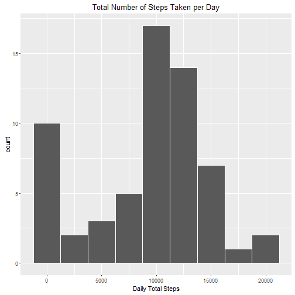
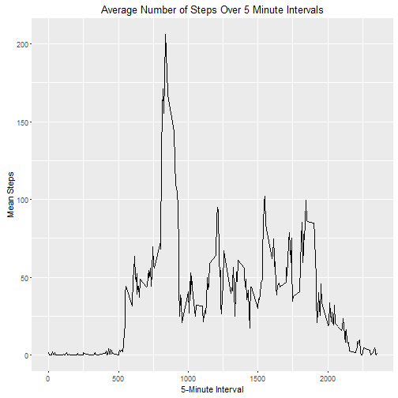
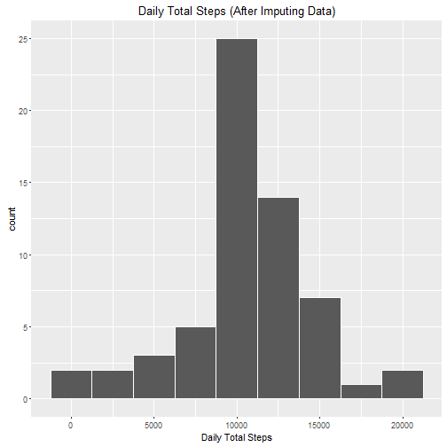
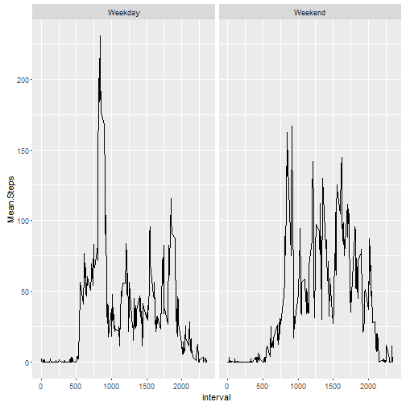

This document describes analysis of activity monitoring data using R and R Markdown. It uses the `activity.csv` data which is available in the Github repository.

### Loading and preprocessing the data

Let's first load the packages needed for analysis of this data.

```r
library(dplyr)
library(lubridate)
library(ggplot2)
```

Let's read the csv data


```r
data <- read.csv("activity.csv")
```


Now we will transform the date variable into date format.


```r
data$date <- ymd(data$date)
```


### What is mean total number of steps taken per day?

```r
Steps.Per.Day.Total <- data %>% 
        group_by(date) %>% 
        summarise(Total.Steps=sum(steps,na.rm=TRUE))

qplot(Steps.Per.Day.Total$Total.Steps,
      binwidth = 2500,
      xlab = "Daily Total Steps",
      main = "Total Number of Steps Taken per Day",
      col = I("white"))
```



Now we will calculate mean and median number of steps taken each day:


```r
mean(Steps.Per.Day.Total$Total.Steps)
```

```
## [1] 9354.23
```

```r
median(Steps.Per.Day.Total$Total.Steps)
```

```
## [1] 10395
```


### What is the average daily activity pattern?

```r
Mean.Steps.By.Interval <- data %>% 
        group_by(interval) %>% 
        summarise(Mean.Steps = mean(steps, na.rm=TRUE)) 

qplot(data=Mean.Steps.By.Interval,
      x = interval,
      y = Mean.Steps, 
      xlab = "5-Minute Interval",
      ylab = "Mean Steps",
      main = "Average Number of Steps Over 5 Minute Intervals",
      geom = "line")
```



Let's compute the 5-minute interval that, on average, contains the maximum number of steps:


```r
Mean.Steps.Max <- filter(Mean.Steps.By.Interval,Mean.Steps==max(Mean.Steps))
```

Therefore the 5-minute interval, that on average across all the days in the dataset, contains the maximum number of steps is **835**.

### Imputing missing values
We are going to impute missing data by mean steps from that interval. For this, let's first find out how many missing values are there: 


```r
Tot.NA <- sum(is.na(data$steps))
Tot.NA
```

```
## [1] 2304
```

Now to add the mean interval data to our original dataset, we will detect the missing data values in 'steps' and replace those values with the mean values from that interval.


```r
test_data <- tbl_df(data)
comb_data <- merge(test_data,Mean.Steps.By.Interval)
comb_data  <- comb_data %>% arrange(date)
comb_data$steps <- ifelse(is.na(comb_data$steps),comb_data$Mean.Steps,comb_data$steps)
Impute.Data <- comb_data %>% 
        select(steps,date,interval) %>% 
        tbl_df()
```

### What is mean total number of steps taken per day in the imputed data?

```r
Steps.Per.Day.Total.New <- Impute.Data %>% 
        group_by(date) %>% 
        summarise(Total.Steps=sum(steps))

qplot(Steps.Per.Day.Total.New$Total.Steps,
      geom = "histogram",
      binwidth=2500,
      xlab="Daily Total Steps",
      main = "Daily Total Steps (After Imputing Data)",
      col = I("white"))
```



Let's calculate the mean and median:

```r
mean(Steps.Per.Day.Total.New$Total.Steps)
```

```
## [1] 10766.19
```

```r
median(Steps.Per.Day.Total.New$Total.Steps)
```

```
## [1] 10766.19
```

We see that these values differ from the original mean and median (without imputing the data) with mean shifted towards the median (in this case mean is equal to median). This implies that imputing resulted in a data that is more normally distributed.

### Are there differences in activity patterns between weekdays and weekends?

For this, let's add a new factor variable to categorize the data into weekdays and weekends.

```r
Impute.Data <- Impute.Data %>% 
        mutate(Day.Factor=factor((wday(date)==1)|(wday(date)==7),
                                 labels=c("Weekday","Weekend")))
```

Now, we will group the data into weekdays and weekends using the factor computed above and then calculate the mean steps. Then we will plot the data into panel plots.


```r
Mean.Steps.By.DayType <- Impute.Data %>% 
        group_by(Day.Factor,interval) %>% 
        summarise(Mean.Steps = mean(steps)) 

qplot(data=Mean.Steps.By.DayType,
      x = interval, 
      y = Mean.Steps,
      facets = .~Day.Factor,
      geom="line")
```



The plot above shows that weekday activity has larger peaks during the beginning of the day compared to the weekend suggesting that subjects are more active during the weekday compared to the weekend.


